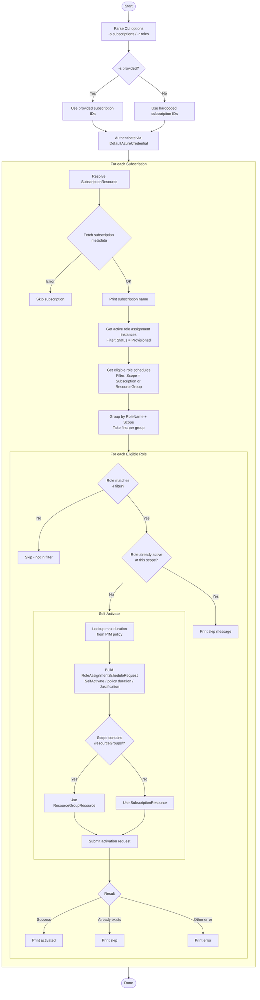
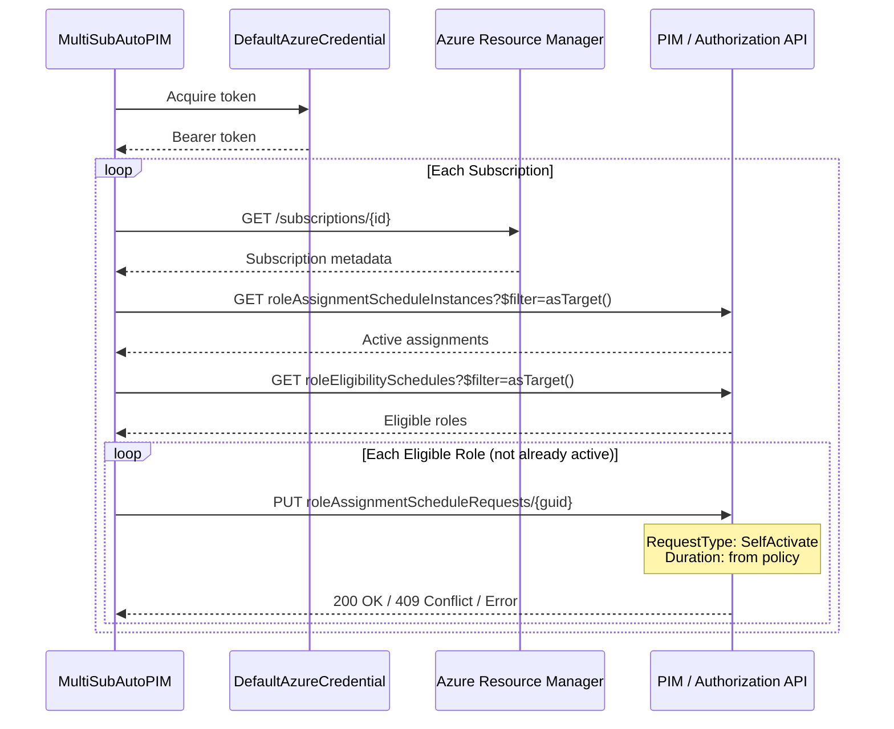

# Architecture

## Overview

MultiSubAutoPIM is a single-file .NET console application that orchestrates Azure PIM role activations across multiple subscriptions using the Azure Resource Manager SDK.

## Flow Diagram



## Component Breakdown

```
Program.cs (top-level statements)
├── CLI Parsing ................ System.CommandLine (-s subscriptions, -r roles)
├── Authentication ............. DefaultAzureCredential (az login / env / browser)
├── ActivatePimRolesAsync()
│   ├── Subscription Loop
│   │   ├── Metadata Fetch ......... Validates subscription access
│   │   ├── Active Assignments ..... RoleAssignmentScheduleInstances (Status=Provisioned)
│   │   ├── Eligible Schedules ..... RoleEligibilitySchedules (Subscription + ResourceGroup)
│   │   ├── Policy Durations ....... RoleManagementPolicyAssignments (max activation time)
│   │   ├── Grouping ............... Dedup by (RoleName, Scope)
│   │   └── Activation Loop
│   │       ├── Role Filter ........ Skip if not in -r list (when specified)
│   │       ├── Skip Check ......... Compare against active assignments
│   │       ├── Request Build ...... RoleAssignmentScheduleRequestData
│   │       ├── Scope Resolution ... Subscription vs ResourceGroup resource
│   │       └── Error Handling ..... "already exists" → skip, other → report
│   └── GetMaxActivationDurationsAsync()
│       └── Reads PIM policy expiration rules (Assignment level)
└── WriteColored() ............. Console helper with color support
```

## Azure SDK Call Chain



## Key Design Decisions

| Decision | Rationale |
|---|---|
| **System.CommandLine** | Structured CLI with `-s` and `-r` options, `--help` for free |
| **Top-level statements** | Keeps the tool as a simple single-file script, no ceremony |
| **DefaultAzureCredential** | Chains multiple auth methods automatically, works everywhere |
| **Role filtering** | `-r` flag uses case-insensitive `HashSet` for O(1) lookups |
| **Group-then-first** | Mirrors the PowerShell `Group-Object \| Select -First` dedup pattern |
| **Policy-based duration** | Reads `RoleManagementPolicyExpirationRule` (Assignment level) per scope |
| **Scope resolution** | PIM API requires the request to be scoped to the exact resource (subscription or resource group) |
| **Catch "already exists"** | Race condition between the active-check and the activation request |
| **Silent catch on fetch** | Non-accessible subscriptions are skipped without breaking the loop |
